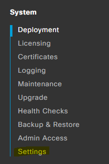
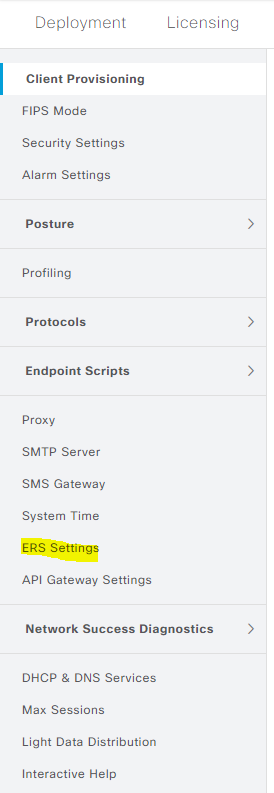

# Merlin on ISE 

## Enable ERS







### Run Merlin on ISE 

```console
pyats run job DevNet_Sandbox_ISE_merlin_job.py
```

```bash
cd Camelot/Cisco/DevNet_Sandbox/ISE

ls 
```

To view the pyATS log in a web browser Locally

```bash
pyats logs view
```

To view the pyATS log in a web browser remotely

```bash
pyats logs view --host 0.0.0.0 --port 8080 -v
```


[Back to the main project](https://github.com/automateyournetwork/merlin)