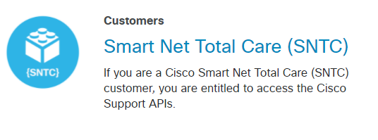
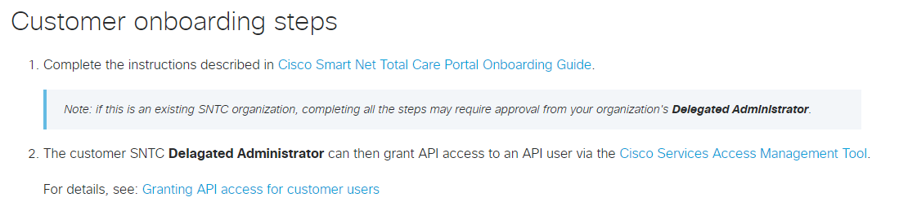
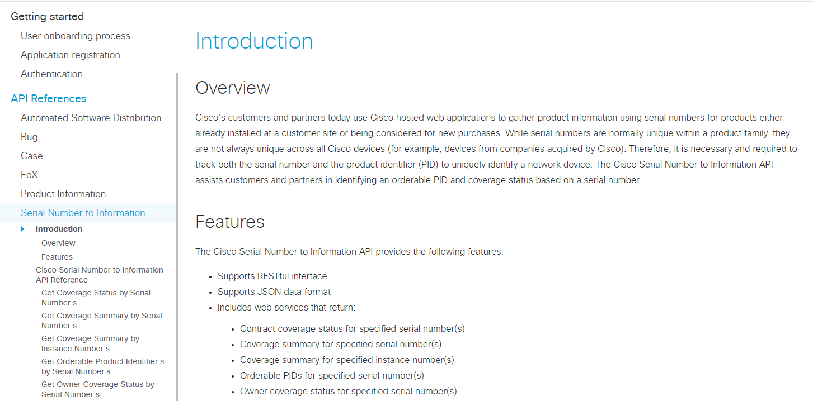
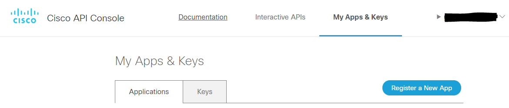
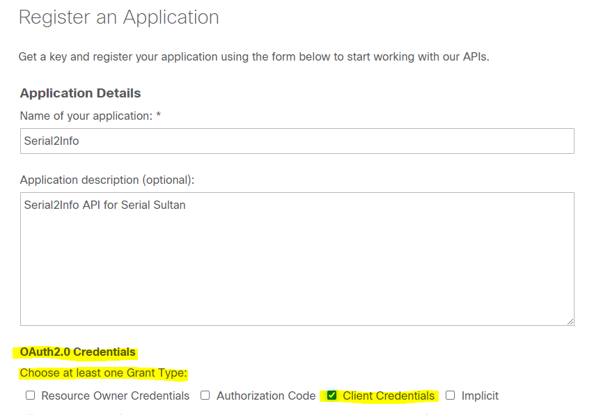
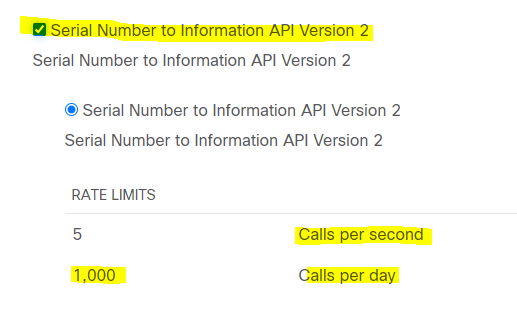

# Excalibur - Automated Asset Management

Excalibur runs the show inventory and (on Nexus) show interface transceiver commands (Cisco) and uses various APIs (F5) to gather, collect, and transform your network assets into business-ready documentation!

## Prerequisites

### Step 1 - Required - Update Your Testbed

Update the /testbed/Excalibur_testbed.yaml file

There are placeholders for the following platforms, which have all been tested:

    IOS:

        2960

        3560

        3750

        6500

        ISR 891FW

    IOS-XE:

        3850

        9300

        4500

        ISR 4400

    NXOS:

        Nexus 9k

        Nexus 7k

        Nexus 5k

        Nexus 2k FEX

Simply move your existing pyATS testbed devices into this file or complete the following appropriate to your inventory

```yaml
devices:
    6500:
      alias: '6500'
      type: 'router'
      os: 'ios'
      platform: cat6500
      credentials:
        default:
          username: {{ SSH Username }}
          password: {{ SSH Password }}
      connections:        
        cli:
          protocol: ssh
          ip: "{{ SSH IP Address }}"
          arguments:
            connection_timeout: 360
            
    4500:
      alias: '4500'
      type: 'router'
      os: 'iosxe'
      platform: cat4500
      credentials:
        default:
          username: {{ SSH Username }}
          password: {{ SSH Password }}
      connections:        
        cli:
          protocol: ssh
          ip: "{{ SSH IP Address }}"
          arguments:
            connection_timeout: 360

    3850:
      alias: '3850'
      type: 'switch'
      os: 'iosxe'
      platform: cat3850
      credentials:
        default:
          username: {{ SSH Username }}
          password: {{ SSH Password }}
      connections:        
        cli:
          protocol: ssh
          ip: "{{ SSH IP Address }}"
          arguments:
            connection_timeout: 360 

    3750:
      alias: '3750'
      type: 'switch'
      os: 'ios'
      platform: cat3750
      credentials:
        default:
          username: {{ SSH Username }}
          password: {{ SSH Password }}
      connections:        
        cli:
          protocol: ssh
          ip: "{{ SSH IP Address }}"
          arguments:
            connection_timeout: 360

    9300:
      alias: '9300'
      type: 'switch'
      os: 'iosxe'
      platform: c9300
      custom:
        abstraction:
          order: [os, platform]      
      credentials:
        default:
          username: {{ SSH Username }}
          password: {{ SSH Password }}
      connections:        
        cli:
          protocol: ssh
          ip: "{{ SSH IP Address }}"
          arguments:
            connection_timeout: 360

    3560:
      alias: '3560'
      type: 'switch'
      os: 'ios'
      platform: cat3560
      credentials:
        default:
          username: {{ SSH Username }}
          password: {{ SSH Password }}
      connections:        
        cli:
          protocol: ssh
          ip: "{{ SSH IP Address }}"
          arguments:
            connection_timeout: 360

    2960:
      alias: '2960'
      type: 'switch'
      os: 'ios'
      platform: cat2960
      credentials:
        default:
          username: {{ SSH Username }}
          password: {{ SSH Password }}
      connections:        
        cli:
          protocol: ssh
          ip: "{{ SSH IP Address }}"
          arguments:
            connection_timeout: 360

    ISR:
      alias: 'ISR'
      type: 'router'
      os: 'ios'
      platform: isr
      credentials:
        default:
          username: {{ SSH Username }}
          password: {{ SSH Password }}
      connections:        
        cli:
          protocol: ssh
          ip: "{{ SSH IP Address }}"
          arguments:
            connection_timeout: 360

    NXOS:
      alias: 'NXOS'
      type: 'router'
      os: 'nxos'
      platform: nxos
      credentials:
        default:
          username: {{ SSH Username }}
          password: {{ SSH Password }}
      connections:        
        cli:
          protocol: ssh
          ip: "{{ SSH IP Address }}"
          arguments:
            connection_timeout: 360
```

### Step 2 - Required - Obtain Your Cisco Serial 2 Info REST API Credentials 

[Cisco Support APIs](https://developer.cisco.com/site/support-apis/)

* Bug information
* TAC case information
* End-of-X information
* Product information
* RMA information
* Software Suggestion (Gold Star)
* Serial 2 Infomation

Click the Smart Net Total Care (SNTC) Link



Follow the OnBoarding process to get access to SNTC



Optional - Read the Serial 2 Info REST API documentation



In the Cisco API Console in the main Apps & Keys page



Register a new app

Give it a name and description

* Important - make sure you select Client Credentials



Select the Serial 2 Info API

* Note that out of the box Excalibur can handle up to 1,000 unique serial numbers per 24 hours

* If you have more devices / parts than this you can register individual Applications per-group of devices

* You can work with me or refactor the code to send different API credentials per-group of devices if scaling becomes an issue



Update the api_credentials/cisco_serial2info.yaml file with your client key and secret

```yaml
APIs:
  serial_2_info:
    serial_2_info_api_username: {{ your client key here }}
    serial_2_info_api_password: {{ your secret here }}
```

### Step 3 - Optional - F5

If you have F5 with the REST API enabled you can also capture the SFP and platform serial numbers with Excalibur ! 

Simply update the testbed/Excalibur_f5_testbed.yaml file with the F5 IP address and REST API username and password. Add as many F5 platforms as you like!

```yaml
devices:
    F5:
      alias: 'F5'
      type: 'F5'
      os: 'BIGIP'
      platform: i2600
      credentials:
        default:
          username: {{ F5 API Username }}
          password: {{ F5 API Password}}
      connections:        
          ip: "{{ F5 REST API IP Address }}"
```

* IMPORTANT 

If you do *not* have any F5 devices *delete or rename* the testbed/Excalibur_f5_testbed.yaml file before you run the job!

### Step 4 - Optional - SharePoint

Excalibur can automatically POST the CSV files into a SharePoint document library!

Simply update the api_credentials/sharepoint.yaml file with your environment information (domain, Sharepoint URL, username, password)

```yaml
APIs:
  inventory:
    sharePointUrl: 'https://{{ mydomain.com }}'
    folderUrl: '/Inventory'
    sharePointFileName: "Inventory/Inventory.csv"
    uploadFileName: "Inventory.csv"
    sharepoint_domain: mydomain
    sharepoint_user: {{ domain_user_name }}
    sharepoint_password: {{ domain_password }}
  contracts:
    sharePointUrl: 'https://{{ mydomain.com }}'
    folderUrl: '/Inventory'
    sharePointFileName: "Inventory/Contracts.csv"
    uploadFileName: "Contracts.csv"
    sharepoint_domain: mydomain
    sharepoint_user: {{ domain_user_name }}
    sharepoint_password: {{ domain_password }}
```

* IMPORTANT 

If you do *not* have a Sharepoint document library *delete or rename* the api_credentials/sharepoint.yaml file before you run the job

# You are ready to run Excalibur

You will also need Python 3, pip, and venv installed on your host system.

In your project directory, create your virtual environment

```console
python3 -m venv env
```

Activate (use) your new virtual environment (Linux):

```console
source env/bin/activate
```

Download or clone the Merlin repository:

```console
git clone https://github.com/automateyournetwork/merlin
```

Install pyATS, Rich, markmap, netjsongraph, xmltodict and TinyDB into your environment:

```console
pip install pyats[full]
```

```console
pip install rich
```

```console
pip install xmltodict
```

```console
pip install tinydb
```

```console
sudo apt update
sudo apt install npm
sudo npm install markmap-cli -g
npm install netjsongraph.js --save
```

---
If you run into any installation issues with pyATS, please see the installation guide here: <https://pubhub.devnetcloud.com/media/pyats-getting-started/docs/install/installpyATS.html>

---

When you are finished with your Merlin session, enter the `deactivate` command to exit the python virtual environment.

Ensure SSH connectivity at from your host's CLI, and run the pyATS job:

```console
pyats run job Excalibur_job.py --testbed-file testbed/Excalibur_testbed.yaml
```

As with all my code I did my very best to test this across the board and at scale. I am always here to try and help - just open an Issue if you encounter any problems or reach out to me on Twitter @john_capobianco

[Back to the main project](https://github.com/automateyournetwork/merlin)